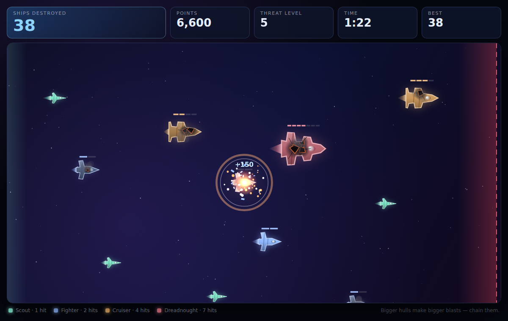
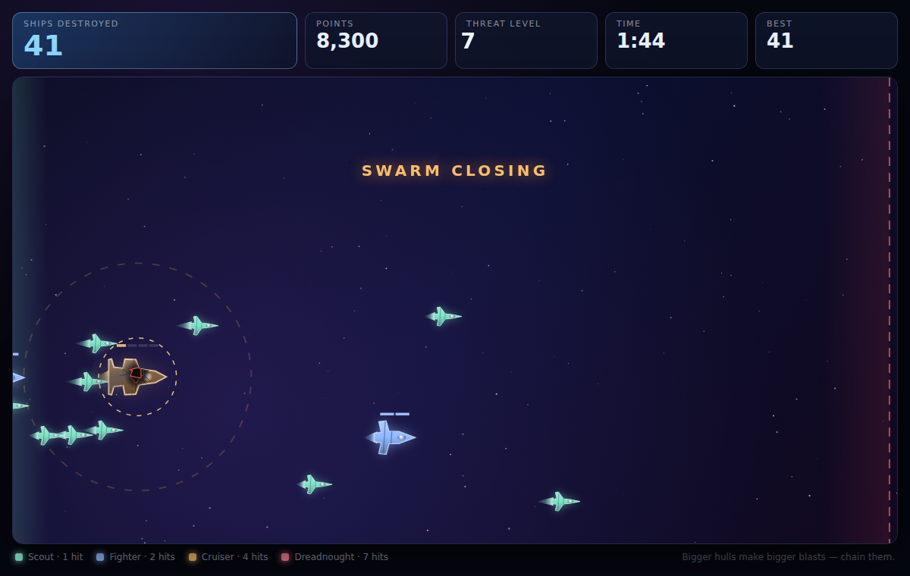

# Sector Defence — a browser space combat game

A small arcade game written in TypeScript and rendered on a 2D canvas. Enemy
ships stream in from the left; you shoot them by clicking. Anything that reaches
the red line on the right ends the run.



## Play

```bash
npm install     # only needed to rebuild; the compiled game is committed
npm start       # builds and serves on http://localhost:8080
```

`npm start` builds `src/` into `dist/` and serves the folder over HTTP. A plain
static server works just as well — the page loads ES modules, so opening
`index.html` straight from the filesystem (`file://`) will not work.

## How it plays

- **Click a ship to hit it.** Scouts pop in one hit; bigger hulls need several.
- **Damage is visible and it hurts.** Each hit burns a hole in the hull, leaves
  cracks and trailing smoke, and slows the ship down — a nearly dead hull limps
  along at roughly 40% of its cruising speed.
- **Everything explodes outwards.** A destroyed ship throws out an expanding
  shockwave. Ships caught in it take damage that falls off with distance, and
  anything that dies to a shockwave sets off its own — so a well-placed hit on a
  cruiser in a tight formation can clear half the screen.
- **Chains pay.** Every link in a chain reaction raises the point multiplier;
  the chain depth is shown over the wreck.
- **Convoys are the set piece.** From threat level 3, a heavy ship arrives
  alone, ringed with a dashed marker and a faint circle showing how far its
  death blast reaches. Seconds later a swarm of light ships is released behind
  it. The swarm is faster, so it closes the gap — and because damage slows the
  heavy down, *how hard you hit it decides where they meet*. Leave it untouched
  and the swarm never catches up; soften it and the cloud piles into your bomb
  mid-field. Hold the last hit until they are inside the ring, then take the
  whole formation with one click. The ring pulses once the hull is one hit from
  death: that is your bomb, armed.



- **Pressure ramps up.** Ships spawn faster, fly faster, and heavier classes
  join the fight as the threat level rises (one level every 16 seconds).
- **One breach and it's over.** If any ship crosses the line on the right, the
  run ends.

| Class | Hits | Speed | Blast |
| --- | --- | --- | --- |
| Scout | 1 | fastest | small |
| Fighter | 2 | fast | medium |
| Cruiser | 4 | slow | large |
| Dreadnought | 7 | slowest | huge |

Controls: **click** to fire, **Space/Enter** to start or restart, **P** or
**Esc** to pause. The best "ships destroyed" count is kept in `localStorage`.

## Layout

| Path | What it holds |
| --- | --- |
| `src/main.ts` | Entry point; wires the canvas and HUD to the game |
| `src/game.ts` | Loop, spawning, difficulty ramp, chain reactions, drawing |
| `src/ship.ts` | Ship state, hull shapes, damage decals, rendering |
| `src/convoy.ts` | Convoy set pieces: cloud layout and release timing |
| `src/effects.ts` | Explosions, particles, floating text, screen shake |
| `src/starfield.ts` | Parallax background |
| `src/hud.ts` | Score readouts and overlays (DOM) |
| `src/config.ts` | Ship classes and all difficulty tuning constants |
| `dist/` | Compiled output, committed so the game runs without a build |

Tuning lives in one place: `TUNING`, `SHIP_TYPES` and `CONVOY` in
`src/config.ts`. Convoy feel is mostly `CONVOY.launchFraction` (how big a gap
the swarm has to close) and `CONVOY.depth` / `laneSpread` (how tightly the
cloud packs, and so how much of it one blast can reach).

## Development

```bash
npm run build   # one-off compile
npm run watch   # recompile on change
```

No runtime dependencies; TypeScript is the only devDependency.
